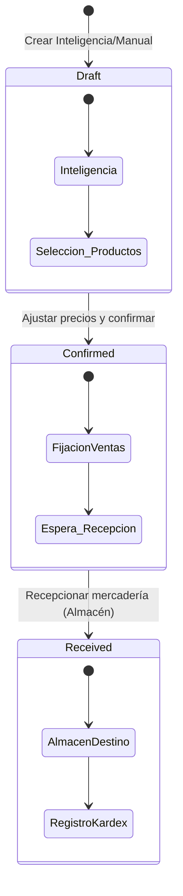
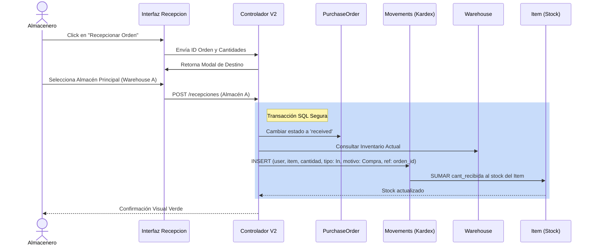

# Plan Arquitectónico y Funcional: Sistema de Compras V2 e Inteligencia de Negocios

Este documento constituye la especificación técnica y funcional completa para el desarrollo del **Nuevo Módulo de Compras V2** en el sistema Iron.

**Estado:** Aprobado para Diseño y Desarrollo
**Autor:** Reinaldo (Usuario) / Asistente IA
**Fecha:** 2026-02-19

---

## 🚨 REQUISITO CRÍTICO: Preservación del Historial, Base de Datos y Sistema Antiguo

**Regla de Oro:** Este nuevo método de compras (V2) **DEBE CREARSE UTILIZANDO ÚNICAMENTE LA BASE DE DATOS ACTUAL**. El método antiguo de compras debe permanecer **completamente funcional y sin sufrir ningún tipo de cambio** para que los usuarios puedan seguir usándolo si lo desean.

| Regla de Negocio | Descripción Técnica | Consecuencia |
| :--- | :--- | :--- |
| **Conservar Tablas Actuales** | Se utilizarán las entidades base existentes sin modificar su estructura: `PurchaseOrder`, `PurchaseOrderLine`, `Item`, `Movement`, `Warehouse`, `Reception`. | Garantiza la integridad del *schema* y las relaciones actuales. |
| **Aislamiento Funcional Total** | Se crearán **Nuevos Controladores / Namespaces** (ej. `SmartPurchasesController` o `purchases_v2`) y nuevas vistas de forma totalmente separada. | El flujo y código del sistema antiguo (`/purchase_orders`) no sufre apagones, cambios, ni bugs colaterales. Permanece 100% operativo. |
| **Inmutabilidad del Historial** | Queda **estrictamente prohibido** utilizar la técnica de "destruir y recrear" (`destroy_all` y `.create`) al actualizar líneas. | Salvaguardamos la historia del inventario y la trazabilidad contable. |

---

## 1. Arquitectura de Estados de una Orden de Compra

El flujo de compras es lineal pero flexible, diseñado para proteger la entrada de stock hasta el último momento.

---

## 2. Fase 1: Módulo de Inteligencia de Compras (Planificación)

Antes del compromiso financiero, el sistema permite simular y planificar basados en el consumo real del negocio.

### Matriz de Análisis de Rotación (Tabla en Interfaz)

| No. | Métrica / Columna | Origen de Datos (Backend) | Tipo |
| :--- | :--- | :--- | :--- |
| 1 | **Detalle (Item)** | `Item.name` filtrado por `ItemsSupplier` o todo catálogo. | Texto Léxico |
| 2 | **Stock Actual** | Total: `item.stock` o desglosado por `Warehouse`. | Indicador |
| 3 | **Último Precio** | Precio de última `PurchaseOrderLine` confirmada. | Referencia |
| 4 | **Cant. Sugerida (Input)** | Entrada manual del usuario para generar el borrador. | **Editable** |
| 5 | **Promedio Q Diario** | Cantidad promedio vendida por día (`SUM(qty 3 años) / 1095`). | Analytics |
| 6 | **Promedio Q Semanal** | Cantidad promedio vendida por semana (`SUM(qty 3 años) / 156`). | Analytics |
| 7 | **Promedio Q Mensual** | Cantidad promedio vendida por mes (`SUM(qty 3 años) / 36`). | Analytics |
| 8 | **Promedio Q Trimestral** | Cantidad promedio vendida por trimestre (`SUM(qty 3 años) / 12`). | Analytics |
| 9 | **Promedio Q Semestral** | Cantidad promedio vendida por semestre (`SUM(qty 3 años) / 6`). | Analytics |
| 10 | **Promedio Q Anual** | Cantidad promedio vendida por año (`SUM(qty 3 años) / 3`). | Analytics |
| 11 | **Histórico Año -1** | Promedio Q: `SUM(Año -1) / 12`. Tendencia mensual de hace 1 año. | Analytics Pesado |
| 12 | **Histórico Año -2** | Promedio Q: `SUM(Año -2) / 12`. Tendencia mensual de hace 2 años. | Analytics Pesado |
| 13 | **Histórico Año -3** | Promedio Q: `SUM(Año -3) / 12`. Tendencia mensual de hace 3 años. | Analytics Pesado |

> ⚡ **Optimización:** Las columnas de *Analytics* requieren consultas SQL pre-agrupadas (ej. `GROUP BY item_id`) para evitar el problema de N+1 consultas (Query N+1) dada la inmensidad de datos en un periodo de 3 años.

---

## 3. Fase 2: Flujo Operativo y de Abastecimiento

Descripción detallada de las acciones por etapa del ciclo de vida de la orden.

### Matriz de Acciones por Estado

| Etapa | Pantalla / Modal | Datos Clave Involucrados | Reglas de Negocio / Validaciones |
| :--- | :--- | :--- | :--- |
| **Borrador (Draft)** | Interfaz de Orden | Proveedor, Productos, Fecha, Tipo Pago. | - Validar proveedor existente. - Auto-sugerir último precio de compra al agregar línea. - Stock y Kardex: **0 movimientos**. |
| **Confirmación** | Tabla de Líneas | Precios finales pactados con Proveedor. | - Confirmación individual o masiva de líneas. - Bloqueo parcial de edición posterior a confirmación en precios. |
| **Fijación Precios** | Modal Especial | Precio de Compra (`Cost`), Margen (%), Nuevo Precio Venta. | - **Trigger:** Al confirmar la orden. - Actualiza las tablas de Listas de Precios de Venta. - No afecta reportes retrospectivos. |
| **Recepción** | Interfaz de Ingreso | **Almacén (`Warehouse`)**, Cantidades físicas. | - Usuario DEBE seleccionar explícitamente el Almacén de destino. - Aumenta `Item.stock`. - Impacta Historial/Kardex. |

---

## 4. Diagrama de Secuencia: Abastecimiento y Kardex (Fase Crítica)

Este diagrama explica cómo el sistema maneja la entrada física de mercancía sin corromper el diseño de base de datos actual.

---

## 5. Roadmap de Implementación Sugerido

Para llevar este plan a la realidad de madera segura:

1.  **Fundamentos V2 (Rutas y Controladores Básicos):**
    *   Crear rutas bajo nuevo namespace (ej. `/compras_v2/dashboard`).
    *   Crear controlador estático inicial.
2.  **Motor de Inteligencia SQL (El "Cerebro"):**
    *   Crear métodos de clase / scopes en el modelo `Item` o módulos concernientes para calcular las ventas (1 día a 3 años) de forma agregada usando `ActiveRecord`.
3.  **Interfaz de Planificación Inteligente:**
    *   Desarrollar vistas HTML/JS para la selección de Proveedor y carga de la tabla de análisis de rotación.
4.  **Flujo Operacional y Modales (Confirmación + Precios):**
    *   Programar el borrador y la lógica de transición a Confirmado.
    *   Crear Modal de Actualización de Precios de Venta.
5.  **Recepción y Abastecimiento Strict:**
    *   Programar el paso de Recepción.
    *   Implementar inyección rigurosa en `Movements` asociando siempre a un `Warehouse` y sumando el `Stock`.

---
*Este plan blinda el sistema antiguo, provee un dashboard analítico sin precedentes en el sistema Iron y estandariza el ingreso físico de mercancía por almacenes y movimientos.*
