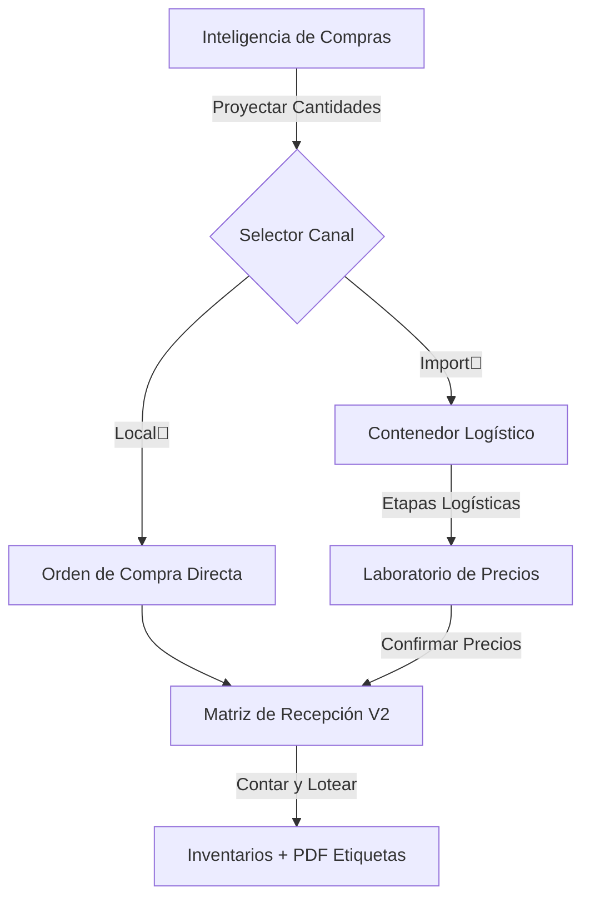

# Manual de Usuario: Inteligencia de Compras V2 (Iron) 🚀🦾📦

Este manual detalla el uso del sistema modernizado para la adquisición, recepción y trazabilidad de mercadería.

---

### 1. El Nuevo Ciclo de Abastecimiento
El flujo de Iron ahora separa la Planeación (Qué comprar) de la Ejecución Logística (Cómo recibir).

#### Diagrama de Operaciones (Secuencia)

### 2. Guía por Módulo

#### 📍 Dashboard de Inteligencia
*   Priorización: Los productos están agrupados por categoría y prioridad (ALTA/MEDIA/BAJA). Enfócate siempre en la prioridad ALTA primero.
*   Selector de Canal: Antes de generar el borrador, elige el origen en el selector azul: Compra Local vs Importación.
*   Costos: El sistema hereda automáticamente el último precio de compra para el borrador.

#### 🏠 Compras Locales (Canal A)
1. En la Orden de Compra, presiona el botón verde "Iniciar Recepción Local".
2. Matriz de Recepción: Cuenta físicamente lo que llegó.
3. Presentación: Si viene en cajas/sacos, elígela para que el sistema multiplique las unidades automáticamente.
4. Loteo y Vencimiento: El sistema genera un código automático L-Fecha-ID. Puedes ajustarlo si el proveedor ya trae un lote.
5. Bodega Destino: Selecciona a qué sucursal va cada ítem.

#### 🚢 Importaciones (Canal B)
1. Vincula tu O.C. al contenedor.
2. Al llegar a la fase "Recibido", usa el Laboratorio de Precios para ajustar márgenes.
3. Al aprobar los precios, el sistema habilitará el botón verde de "Recibir" en cada orden del contenedor. Esto te llevará a la Matriz de Recepción para el ingreso físico masivo.

#### 🏷️ Lotes y Etiquetado
*   Blindaje: El sistema no permite recibir una orden dos veces.
*   PDF de Imprimir: Al finalizar cualquier recepción, se genera automáticamente un Hoja de Etiquetas con SKU, Lote, Vencimiento y Precio.

---
Manual generado por Antigravity para Reinaldo - Iron Modernización Compras V2 - Marzo 2026
